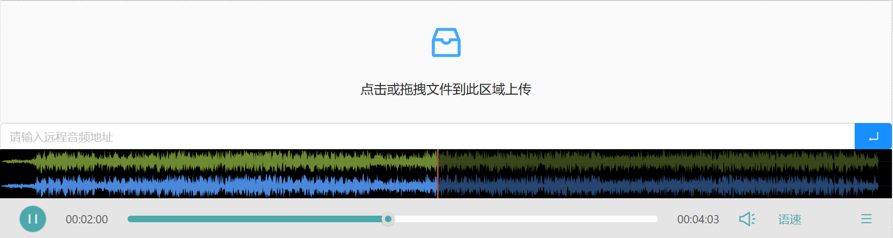

2.0.1-beta.1

带音频波形显示的音频播放器,基于wavesurferjs,倍速播放优化使用了soundtouchjs

当前版本只提供默认主题

|      参数       |                             说明                             |          类型          | 默认值  |
| :-------------: | :----------------------------------------------------------: | :--------------------: | :-----: |
|      theme      |                             主题                             |        `string`        | default |
|     config      | [wavesurfer.js基础配置项](https://wavesurfer-js.org/docs/options.html)，设置该参数会使主题基础配置失效 |        `object`        |    -    |
|     plugins     | [wavesurfer.js插件配置](https://wavesurfer-js.org/plugins/)，设置该参数会使主题插件配置失效 |        `object`        |    -    |
|      file       |                           音频文件                           | `string`、`File`、`Blob` |    -    |
|   isDownload    |                         是否启用下载                         |       `boolean`        |  false  |
|    autoplay     |                           自动播放                         |       `boolean`        |  false  |
| onWaveSurferRef |                     返回`WaveSurfer`实例                     |    `(ref) => void`     |    -    |
|     onPlay      |                        开始播放时触发                        |      `() => void`      |    -    |
|     onPause     |                          暂停时触发                          |      `() => void`      |    -    |
|    onFinish     |                        播放完成时触发                        |      `() => void`      |    -    |
|     onSeek      |        播放进度改变时触发，返回百分比浮点进度`[0-1]`         |     `(e) => void`      |    -    |
| onAudioprocess  |               播放时持续触发，返回播放进度`s`                |     `(e) => void`      |    -    |
|     onReady     |                      音频加载完成时触发                      |      `() => void`      |    -    |
|    onLoading    |                         音频加载状态                         |     `(e) => void`      |    -    |
|     onError     |            错误监听，设置以覆盖默认的解码错误提示            |     `(e) => void`      |    -    |

